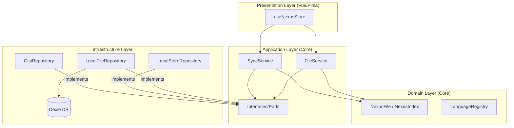

# Project Nexus

**System Role**: Distributed Configuration Command Center
**Architecture Pattern**: Clean Architecture / Local-First / Domain-Driven Design
**Primary Store**: GitHub Gist (Private)
**Local Cache**: IndexedDB (Dexie.js)

---

## 🏗️ Architecture Overview

The system strictly adheres to **Clean Architecture** principles, separating business logic from UI and infrastructure.



---

## 📂 Directory Structure

```text
src/
├── core/                     # [Inner Ring] Pure TypeScript, Framework-agnostic
│   ├── domain/               # Enterprise Business Rules
│   │   ├── entities/         # Rich Models (NexusFile)
│   │   ├── services/         # Domain Services (LanguageRegistry)
│   │   └── shared/           # Shared Kernels (IdGenerator)
│   └── application/          # Application Business Rules
│       ├── ports/            # Repository Interfaces (IGistRepository, IFileRepository)
│       └── services/         # Use Cases (SyncService, FileService)
│
├── infrastructure/           # [Outer Ring] Adapters & Implementations
│   ├── db/                   # Local Persistence (Dexie)
│   ├── github/               # External API (Octokit)
│   └── storage/              # Configuration Storage (LocalStorage/Chrome Storage)
│
├── stores/                   # [Presentation] State Management
│   └── useNexusStore.ts      # ViewModel / Controller Logic
│
└── services.ts               # Dependency Injection Container
```

---

## 🧩 Core Concepts

### Domain Layer
*   **NexusFile**: The aggregate root for configuration files. Encapsulates logic for filename generation (`id` + `language` -> `filename`) and dirty state tracking.
*   **LanguageRegistry**: Domain service producing standard file extensions from language identifiers.

### Application Layer
*   **SyncService**: ORCHESTRATOR for data synchronization.
    *   *Strategy*: Smart Sync (Incremental Metadata Check -> Full Fetch).
    *   *Conflict*: Timestamp-based detection.
*   **FileService**: HANDLER for file operations.
    *   *Flow*: Update Local DB -> Update In-Memory Index -> Async Push to Gist.

### Infrastructure Layer
*   **GistRepository**: Implementation of `IGistRepository` using Octokit. Handles the complexity of Gist JSON mapping.
*   **LocalFileRepository**: Implementation of `IFileRepository` using Dexie. Maps `NexusFile` entities to simpler database records.

---

## 🔄 Data Flow Patterns

### 1. Synchronization (Inbound)
1.  **Check**: `SyncService` fetches Gist metadata (`updated_at`).
2.  **Compare**: If remote > local, fetch full Gist content.
3.  **Hydrate**: Parse JSON to `NexusIndex` and `NexusFile` entities.
4.  **Persist**: Bulk save to `NexusDB` (Local Cache).

### 2. File Modification (Outbound)
1.  **Update**: User edits content -> `FileService` updates `NexusFile`.
2.  **Persist**: Immediate save to `NexusDB`.
3.  **Push**: Async call to `SyncService.pushFile` (optimistic update).

### 3. Index Modification (Structure Change)
1.  **Update**: User adds/renames file -> `NexusIndex` updated in memory.
2.  **Push**: Critical `nexus_index.json` update pushed to Gist immediately to maintain consistency.

---

## 🛠️ Technology Stack

*   **Runtime**: Browser Extension / Web
*   **Framework**: Vue 3 + Pinia
*   **Language**: TypeScript 5.x
*   **Persistence**: Dexie.js (IndexedDB wrapper)
*   **Network**: Octokit (GitHub REST API)
