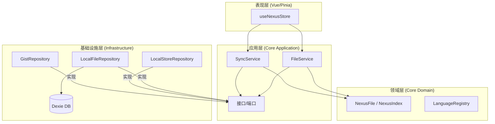

# Project Nexus

**系统角色**: 分布式配置指挥中心
**架构模式**: 整洁架构 (Clean Architecture) / 本地优先 (Local-First) / 领域驱动设计 (DDD)
**主存储**: GitHub Gist (私有)
**本地缓存**: IndexedDB (Dexie.js)

---

## 🏗️ 架构概览

本系统严格遵循 **整洁架构** 原则，将业务逻辑与 UI 及基础设施分离。



---

## 📂 目录结构

```text
src/
├── core/                     # [内环] 纯 TypeScript，无关框架
│   ├── domain/               # 企业级业务规则
│   │   ├── entities/         # 充血模型 (NexusFile)
│   │   ├── services/         # 领域服务 (LanguageRegistry)
│   │   └── shared/           # 共享内核 (IdGenerator)
│   └── application/          # 应用业务规则
│       ├── ports/            # 仓储接口 (IGistRepository, IFileRepository)
│       └── services/         # 用例 (SyncService, FileService)
│
├── infrastructure/           # [外环] 适配器与实现
│   ├── db/                   # 本地持久化 (Dexie)
│   ├── github/               # 外部 API (Octokit)
│   └── storage/              # 配置存储 (LocalStorage/Chrome Storage)
│
├── stores/                   # [表现层] 状态管理
│   └── useNexusStore.ts      # ViewModel / 控制器逻辑
│
└── services.ts               # 依赖注入容器
```

---

## 🧩 核心概念

### 领域层 (Domain Layer)

- **NexusFile**: 配置文件的聚合根。封装了文件名生成逻辑 (`id` + `language` -> `filename`) 和脏状态跟踪。
- **LanguageRegistry**: 领域服务，用于根据语言标识符生成标准文件扩展名。

### 应用层 (Application Layer)

- **SyncService**: 数据同步的 **编排者**。
  - _策略_: 智能同步 (增量元数据检查 -> 全量拉取)。
  - _冲突_: 基于时间戳的检测机制。
- **FileService**: 文件操作的 **处理器**。
  - _流程_: 更新本地 DB -> 更新内存索引 -> 异步推送到 Gist。

### 基础设施层 (Infrastructure Layer)

- **GistRepository**: `IGistRepository` 的实现，使用 Octokit。处理 Gist JSON 映射的复杂性。
- **LocalFileRepository**: `IFileRepository` 的实现，使用 Dexie。将 `NexusFile` 实体映射为简单的数据库记录。

---

## 🔄 数据流模式

### 1. 同步 (入站/Inbound)

1.  **检查**: `SyncService` 获取 Gist 元数据 (`updated_at`)。
2.  **比较**: 如果远程时间 > 本地时间，则拉取完整 Gist 内容。
3.  **水合**: 将 JSON 解析为 `NexusIndex` 和 `NexusFile` 实体。
4.  **持久化**: 批量保存到 `NexusDB` (本地缓存)。

### 2. 文件修改 (出站/Outbound)

1.  **更新**: 用户编辑内容 -> `FileService` 更新 `NexusFile`。
2.  **持久化**: 立即保存到 `NexusDB`。
3.  **推送**: 异步调用 `SyncService.pushFile` (乐观更新)。

### 3. 索引修改 (结构变更)

1.  **更新**: 用户添加/重命名文件 -> 内存中的 `NexusIndex` 更新。
2.  **推送**: 关键的 `nexus_index.json` 更新会立即推送到 Gist 以保持一致性。

---

## 🛠️ 技术栈

- **运行时**: 浏览器扩展 / Web
- **框架**: Vue 3 + Pinia
- **语言**: TypeScript 5.x
- **持久化**: Dexie.js (IndexedDB 封装)
- **网络**: Octokit (GitHub REST API)

---

## 🔧 脚本

### 手动验证

验证 Gist API 的功能和性能：

```bash
npx esno scripts/manual_verify_gist.ts
```
