# Project Nexus

**系统角色**: 分布式配置指挥中心
**架构模式**: 整洁架构 (Clean Architecture) / 本地优先 (Local-First) / 领域驱动设计 (DDD)
**主存储**: GitHub Gist (私有)
**本地缓存**: IndexedDB (Dexie.js)

---

## 🏗️ 架构概览

本系统严格遵循 **整洁架构** 原则，将业务逻辑与 UI 及基础设施分离。

```mermaid
graph TD
    subgraph "表现层 (Vue/Pinia)"
        Store[useNexusStore]
    end

    subgraph "应用层 (Core Application)"
        SyncService[SyncService]
        FileService[FileService]
        PortRepo[接口/端口]
    end

    subgraph "领域层 (Core Domain)"
        Entity[NexusFile / NexusIndex]
        DomainSvc[LanguageRegistry]
    end

    subgraph "基础设施层 (Infrastructure)"
        GistRepo[GistRepository]
        LocalRepo[LocalStoreRepository]
        FileAdapter[LocalFileRepository]
        DB[(Dexie DB)]
    end

    Store --> SyncService
    Store --> FileService
    SyncService --> PortRepo
    FileService --> PortRepo
    SyncService --> Entity
    FileService --> Entity
    GistRepo -- 实现 --> PortRepo
    LocalRepo -- 实现 --> PortRepo
    FileAdapter -- 实现 --> PortRepo
    FileAdapter --> DB
```



---

## 📂 目录结构

```text
src/
├── core/                     # [内环] 纯 TypeScript，无关框架
│   ├── domain/               # 企业级业务规则
│   │   ├── entities/         # 充血模型 (NexusFile)
│   │   ├── services/         # 领域服务 (LanguageRegistry)
│   │   └── shared/           # 共享内核 (IdGenerator)
│   └── application/          # 应用业务规则
│       ├── ports/            # 仓储接口 (IGistRepository, IFileRepository)
│       └── services/         # 用例 (SyncService, FileService)
│
├── infrastructure/           # [外环] 适配器与实现
│   ├── db/                   # 本地持久化 (Dexie)
│   ├── github/               # 外部 API (Octokit)
│   └── storage/              # 配置存储 (LocalStorage/Chrome Storage)
│
├── stores/                   # [表现层] 状态管理
│   └── useNexusStore.ts      # ViewModel / 控制器逻辑
│
└── services.ts               # 依赖注入容器
```

---

## 🧩 核心概念

### 领域层 (Domain Layer)

- **NexusFile**: 配置文件的聚合根。封装了文件名生成逻辑 (`id` + `language` -> `filename`) 和脏状态跟踪。
- **LanguageRegistry**: 领域服务，用于根据语言标识符生成标准文件扩展名。

### 应用层 (Application Layer)

- **SyncService**: 数据同步的 **编排者**。
  - _策略_: 智能同步 (增量元数据检查 -> 全量拉取)。
  - _冲突_: 基于时间戳的检测机制。
- **FileService**: 文件操作的 **处理器**。
  - _流程_: 更新本地 DB -> 更新内存索引 -> 异步推送到 Gist。

### 基础设施层 (Infrastructure Layer)

- **GistRepository**: `IGistRepository` 的实现，使用 Octokit。处理 Gist JSON 映射的复杂性。
- **LocalFileRepository**: `IFileRepository` 的实现，使用 Dexie。将 `NexusFile` 实体映射为简单的数据库记录。
- **LocalHistoryRepository**: 管理文件历史快照，支持时间轴查询和 Gist 历史导入。

---

## 🔄 数据流模式

### 1. 同步 (入站/Inbound)

1.  **检查**: `SyncService` 获取 Gist 元数据 (`updated_at`)。
2.  **比较**: 如果远程时间 > 本地时间，则拉取完整 Gist 内容。
3.  **水合**: 将 JSON 解析为 `NexusIndex` 和 `NexusFile` 实体。
4.  **持久化**: 批量保存到 `NexusDB` (本地缓存)。

### 2. 文件修改 (出站/Outbound)

1.  **更新**: 用户编辑内容 -> `FileService` 更新 `NexusFile`。
2.  **持久化**: 立即保存到 `NexusDB`。
3.  **推送**: 异步调用 `SyncService.pushFile` (乐观更新)。

### 3. 索引修改 (结构变更)

1.  **更新**: 用户添加/重命名文件 -> 内存中的 `NexusIndex` 更新。
2.  **推送**: 关键的 `nexus_index.json` 更新会立即推送到 Gist 以保持一致性。

### 4. 历史回滚 (History Rollback)

1.  **快照**:每次保存 (`FileService`) 会自动在 `NexusDB.history` 表中创建一份快照。
2.  **本地优先**: 历史记录默认读取本地。如果本地为空，支持从 Gist 导入变更历史 (Sync)。
3.  **Diff**: 使用 Monaco Diff Editor 进行全屏对比。

---

## 🛠️ 技术栈

- **运行时**: 浏览器扩展 / Web
- **框架**: Vue 3 + Pinia
- **语言**: TypeScript 5.x
- **持久化**: Dexie.js (IndexedDB 封装)
- **网络**: Octokit (GitHub REST API)

---

## 🚀 开发与构建

### 环境要求

- **Node.js**: >= 18.18.0
- **npm**: >= 9.0.0
- **包管理器**: 仅支持 `npm`

### 安装依赖

```bash
npm install
```

### 本地开发

```bash
npm run dev
```

### Web 模式开发

```bash
npm run dev:web
```

### 打包构建

```bash
npm run build
```

### 类型检查

```bash
npm run typecheck
```

### 运行测试

```bash
npm run test
```

### 监听模式

```bash
npm run test:watch
```

### 覆盖率报告

```bash
npm run test:coverage
```

## ✅ 测试策略

- **单元测试**：与源码就近放置，统一使用 `__tests__` 与 `*.test.ts`。
- **集成测试**：集中放在 `tests/integration`。
- **共享测试资产**：
  - 数据夹具：`tests/fixtures`
  - 测试工厂：`tests/factories`

当前覆盖率门禁（Vitest）：

- lines: `25`
- functions: `55`
- branches: `55`
- statements: `25`

---

## 🔐 隐私与安全 (Privacy & Security)

为了保护敏感配置（如 API Keys、Secrets），系统引入了 **端到端加密 (E2EE)** 机制。

### 核心机制

- **加密标准**: AES-GCM (Advanced Encryption Standard with Galois/Counter Mode)。
- **密钥管理**: 
  - 通过用户设置的“保险库密码 (Vault Password)”与盐值 (Salt) 派生加密密钥。
  - 密码通过 PBKDF2 算法生成 Key，且仅在 Session 或 LocalStorage 中暂存，**绝不上传**。
- **存储形态**:
  - Gist (云端): 存储 Base64 编码的密文。
  - Local DB (本地): 按需解密展示。
- **粒度**: 文件级加密。用户可对特定文件开启 "Secure Mode"。

### 工作流程

1.  **设置密码**: 用户在侧边栏设置保险库密码。
2.  **加密**: 
    - 用户点击编辑器工具栏的“锁”图标 (Toggle Secure)。
    - 系统使用 `CryptoProvider` 加密内容。
    - 保存到本地 DB (标记为 `is_secure_local`)。
    - 推送密文到 GitHub Gist。
3.  **解密**:
    - 系统从 Gist 拉取文件。
    - 检测到 `is_secure` 标记。
    - 使用本地缓存的密码自动解密内容。

---

## 🔧 脚本

### 手动验证

验证 Gist API 的功能和性能：

```bash
npx esno scripts/manual_verify_gist.ts
```

### 分片修复 (Shard Repair)

用于修复 v2 分片结构中的重复/脏统计，并重写每个 shard gist 的可读元信息。

默认是 dry-run（只打印，不写入）：

```bash
npm run repair:shards
```

执行实际修复：

```bash
APPLY=1 npm run repair:shards
```

常用参数（环境变量）：

- `ROOT_GIST_ID`: 指定 root gist（不传则自动发现）
- `REWRITE_README`: 是否重写 shard README（默认 `true`）
- `REWRITE_DESCRIPTION`: 是否重写 shard 描述（默认 `true`）
- `DROP_EMPTY_SHARDS`: 是否从 index 中移除空 shard（默认 `true`）
- `DELETE_ORPHAN_GISTS`: 是否删除已移除的空 shard gist（默认 `false`，建议先 dry-run）
